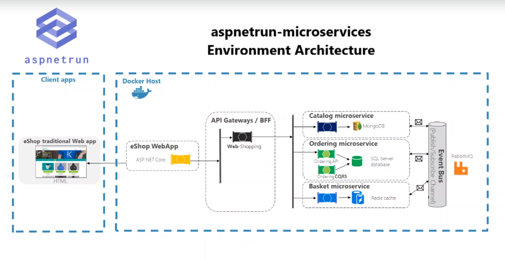
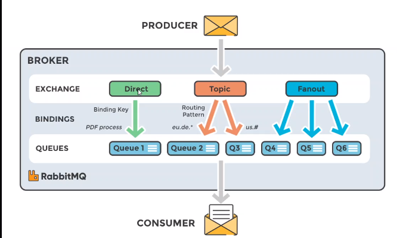
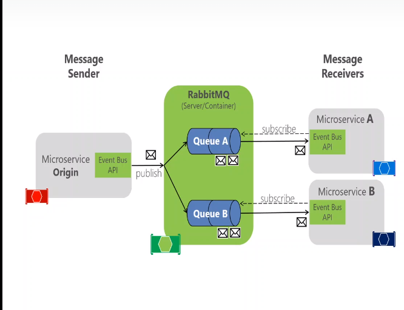

# Microservices Architecture and Implementation oin .Net 5

 # BUILDING CATALOG USRV

* ASP.NET core WEB API application
* REST API principles, CRUD operation
* MONGODB noSql database connector on docker
* N-Layer implementation
* Repository Design Pattern
* Swagger Open API implementation
* DockerFile implementation

>CATALOG API
 * `GET /api/v1/Catalog`
 * `POST /api/v1/Catalog`
 * `PUT /api/v1/Catalog`
 * `GET /api/v1/Catalog/{id}`
 * `DELETE /api/v1/Catalog/{id}`
 * `GET /api/v1/Catalog/GetProductByCategory/{category}`

 ### Installing MongoDb Dockerhub

 * `docker pull mongo`
 * `docker run -d -p 27017:27017 --name aspnetrun-mongo mongo`
 * `docker exec -it aspnetrun-mongo /bin/bash` | enter to mongo

### Installing Swagger - NuGet
* Swashbuckle.AspNetCore 6.0.7

## Docker Operation for Catalog Microservices
* Dockerfile creation
* Dockerfile commands
* Docker-compose file creation
* Docker-compose file commands

### Mongo CLI **commands on docker**

Command | Explanation
-----------|-----------
docker exec -it aspnetrun-mongo /bin/bash |  execute (-it) internal terminal for this image and open the terminal, and start whit the bash commands
`...:/# mongo`| inside mongo `root@6c48eb827707:/# mongo`, execute mongo commands in her
`> show dbs` | list all database in mongo
`> use CatalogoDb` | create a new DB
`> db.createCollection(`Productos`)` | create a new DB
`> db.Products.insertMany(...)` | inside folder PRACTICA, there is a file with it

______________________________________
______________________________________

# BUILDING Basket USRV

* ASP.NET core WEB API application
* REST API principles, CRUD operation
* REDIS DB noSql database connector on docker
* N-Layer implementation
* Repository Design Pattern
* Swagger Open API implementation
* DockerFile implementation

### REDIS - [Docker hub](https://hub.docker.com/_/redis)
* `docker pull redis`
* `docker run -p 6379:6379 --name aspnetrun-redis -d redis` 
* `docker exec -it aspnetrun-redis /bin/bash`
* `regis-cli` | after execute redis
* `set key algunaClave` | generate a new key
* `get key` | get a key

###  NuGet
* StackExchange.Redis
* AutoMapper.Extensions.Microsoft.DependencyInjection

### Run Application on Docker 

* docker stop f4 | stop container with CONTAINER_ID ex: 4e6e1481e4ca `> docker stop 4e`

______________________________________
______________________________________

### Microservices Communication with building RabbitMQ Library
* Microservice communication with RabbitMQ implementation
* Class Library Development for EventBus operation
* RabbitMQ Producer on Basket Microservice web API
* RabbitMQ Consumer on Ordering Microservice web API
* RabbitMQ Consumer on Ordering Microservice web API
* AutoMapper implementation when mapping Event to Microservices entity
* RabbitMq docker implementation

### Main Features
> similar: Apache kafka, Msmq, Microsoft AzureService Bus, Kestrel, ActiveMQ 

Example ROUTING 

**PUBLISHER** ==> publish => **EXCHANGE** ==>routes=> **QUEUE** ==> consumes ==> **CONSUMER**

### Main Logic of RabbitMQ

* **Producer:** is de source of the message is application producer in here, we can call the publisher, In this project, we are going to as a producer of service, Basket microservice, because Basket microservice checkout the basket, It is produce an Event and it'll be consume from the **Order microservice**, when the checkout performing successfully, so that's ew call the consumer is to send the message.
  Application that receive and produce the message on the queue
* **Queue:** is the message stored in here and the sent message are put in queue before they are received, All the incoming message are stored in the queue, That is the memory of the rabbitMQ and we can call the message is it the data we are sending on the queue.
* **Consumer**
* **Message**
* **Exchange:** Is the structure that decide to which queue to send the message because is makes the decision according to do the routing keys: DIRECT, TOPIC, FANOUT
  * *DIRECT:* is not using any routing pattern and directly sending to queue.
  * *TOPIC:* this is using the public subscriber pattern, so that's why it is required by subscribing int their queue
  * *FANOUT:* is using to the broadcasting pattern, so that's why it is sending to them all off to queue
* **FIFO (First in First out)**
  

### [tutotial rabbitMq](https://www.rabbitmq.com/tutorials/tutorial-three-dotnet.html)

### Setup with [Docker](https://hub.docker.com/_/rabbitmq) on Local Environment
* `docker run -d --hostname my-rabbit --name leo-rabbit -p 15672:15672 -p 5672:5672 rabbitmq:3-management`
* uss: guest ; pass: guest

### Analysis & Design of EventBus Class Library

* Create rabbitMQ connection
* Create BasketCheckout Event
* Develop Basket Microservices as Producer of BasketCheckout Event
* Develop Ordering Microservices as Consumer of BasketCheckout Event

### rabbitMQ NuGet
* search NuGet RAbbitMQ.Client 6.2.1

### Basket microservice 
* POST: api/v1/basket/Checkout 
    * when we have a post operation and this post operation perform the checkout method, It is a use case checkout basket
    * It means if the customer had a basket and items after reviewing them basket, it's continue to check out the order and click the checkout BUTTON with  
      giving the other information so it is making an our orders.
    * So we should have a create checkout method inside of the basket microservice, and this checkout API method (POST: api/v1/basket/Checkout
      ) should be use the our nre written **CONSUMER MESSAGE** **PublishBasketCheckout**
______________________________________
______________________________________
# Run final application

# `docker-compose -f docker-compose.yml -f docker-compose.override.yml up -d`
* Cone the repository
* Run command on top of **docker-compose.yml** files; 
`docker-compose -f docker-compose.yml   -f docker-compose.override.yml up -d`

* RabbitMq -> `http://localhost:15672`
* Catalog API -> http://localhost:8000/swagger/index.html
    * `docker-compose -f docker-compose.yml -f docker-compose.override.yml up -d`
* Basket API -> http://localhost:8001/swagger/index.html
    * `docker-compose -f docker-compose.yml -f -d docker-compose.override.yml up --build basket.api`
* Order API -> http://localhost:8002/swagger/index.html
* API Gateway -> http://localhost:7000/orders?username+swn
* Shopping Web UI -> http//localhost:8003

## Docker commands

* `docker -version `
* `docker pull <imane name>`
* `docker run -it -d <image name>` | this command list all the locally stored docker image 
* `docker images` | this command lists all the locally stored docker images 
* `docker rm <container id>` | this command is used to delete a stopped container
* `docker rmi <image-id>` | this command is used to delete an image for local storage
* `docker ps` | this command is used to ist the running containers
* `docker ps -a` | this command is used to list the running containers
* `docker exec -it <container id> bash ` | this command is used to access the running container
* `docker start <container id>`
* `docker stop <container id>`
* `docker restart <container id>`
* `docker info `
* `docker logs <container id> `

* `docker volume create`
* `dockervolume ls `
* `docker build <path to docker file>`  | this command is used to build an image from a specified docker file
* `docker compose up` | this command run multiple container
* `docker rmi [ID IMAGE]` | after consult images `docker images`, remove image with docker 's image 

> Example Bonus Example docker hub pull
* `docker run -d --hostname swn-rabbit --name swn-rabbit -p 5672:5672 -p 15672:15672 rabbitmq:3-management`

> Single container
For aspNetCore app after adding docker file -- for single container add container add docker file build and run == create new container
    `$ docker build -t aspnetapp`
    `$ docker run -d -p 8080:80 --name myapp aspnetapp`

> Multiple Container - **docker-compose.yml**
    docker-compose up

`docker-compose -f docker-compose.yml   -f docker-compose.override.yml up -d` 

## Redis in Use
> We can say that REDIS is an Open Source NoSql database and that data origin holds on the memory. As mentioned in its own documentation, that this is not just a simple key-value server. It is more than the key-value directory server
> the key-value directory server because it has a lot of abilities like storing high-level data structure could be the list, map, sett heap and the json objects and redis is very good performance and in simplicity and automatic manipulation data structures
> when we compare with the traditional relational database is it provider us a god advantage for using redis, also we can say that redis is using in+memory database, which means that redis store your data on the ram and you can certain the same into your disk
> it has certain list so you can ensure that data consistency under advantage offer, redis is keeping your data in memory
> 
> It is very important because it can reduce to read and write operation up to milliseconds, if you compare it to performance, its normal relational databases for this property, it's really good advantage for redis
> When you use the right data structure, you can reduce your costs accessing data by up to 10%

